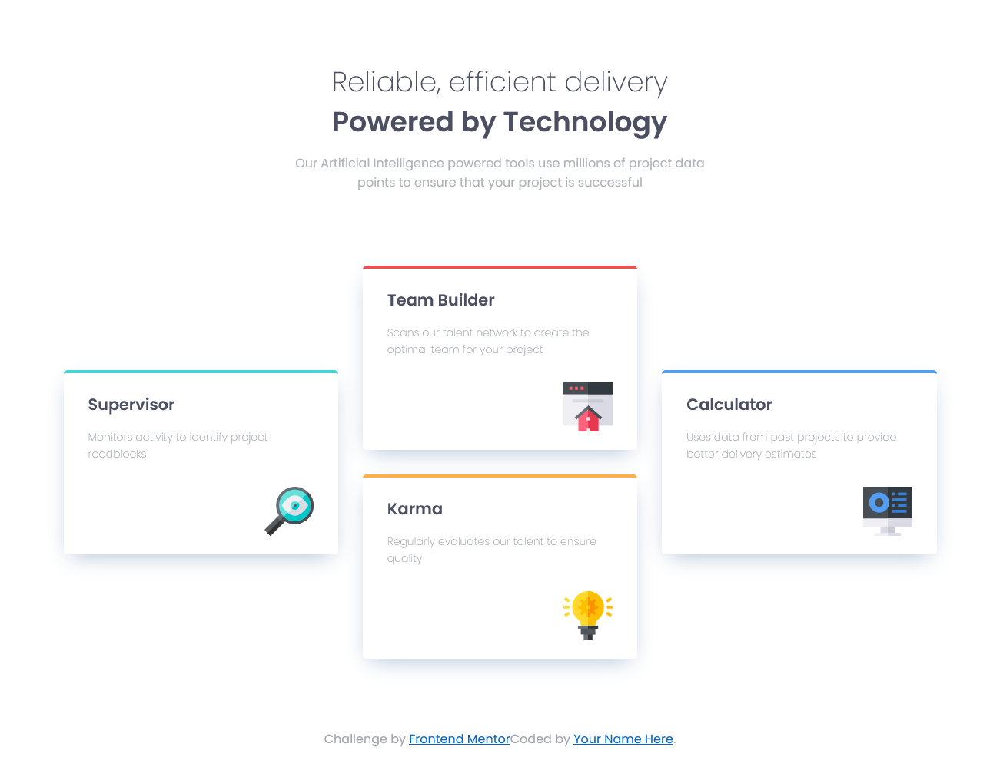

# Frontend Mentor - Four card feature section solution

This is a solution to the [Four card feature section challenge on Frontend Mentor](https://www.frontendmentor.io/challenges/four-card-feature-section-weK1eFYK). Frontend Mentor challenges help you improve your coding skills by building realistic projects. 

## Table of contents

- [Overview](#overview)
  - [The challenge](#the-challenge)
  - [Screenshot](#screenshot)
  - [Links](#links)
- [My process](#my-process)
  - [Built with](#built-with)
  - [What I learned](#what-i-learned)
  - [Continued development](#continued-development)
  - [Useful resources](#useful-resources)
- [Author](#author)

## Overview

### The challenge

Users should be able to:

- View the optimal layout for the site depending on their device's screen size

### Screenshot

### Links

- Solution URL: [Frontend Mentor](https://www.frontendmentor.io/solutions/four-card-feature-section-with-html-and-css-BN5kEGI5e6)
- Live Site URL: [Github Pages](https://azpenmeadows.github.io/fm-four-card-feature-section/)

## My process

### Built with

- Semantic HTML5 markup
- CSS custom properties
- CSS Grid
- Mobile-first workflow

### What I learned

Learned about CSS Grid and how to use grid-template-areas for arrange grid items

### Continued development

I had a lot of funt with CSS grid. I would like to do more grid layouts.

Getting the correct line spacing and padding on the heading and grid cards was harder than I thought. I want to experiment more with how to get the correct spacing based on the design image I have--and on this note, I also want to practice copying design images to get a more exact match than I have in this project (I wanted to move on and keeep learning, rather than spend more time getting every measurement exact)

### Useful resources

- [W3 Schools](https://www.w3schools.com/cssref/css3_pr_box-shadow.php) - This helped me remember the correct values for box-shoadows
- [Kevin Powel YouTube](https://www.youtube.com/watch?v=rg7Fvvl3taU) - This video help me understand CSS grid better. Great resource for anyone just starting out with Grid

## Author

- Github - [AzpenMeadows](https://github.com/AzpenMeadows)
- Frontend Mentor - [@AzpenMeadows](https://www.frontendmentor.io/profile/AzpenMeadows)
